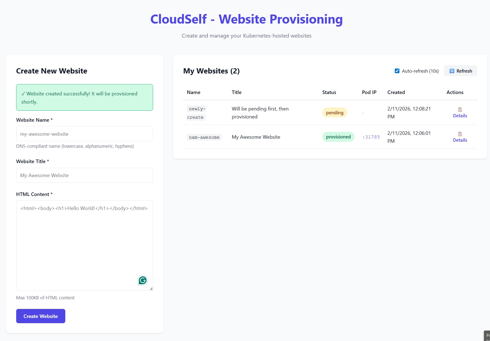
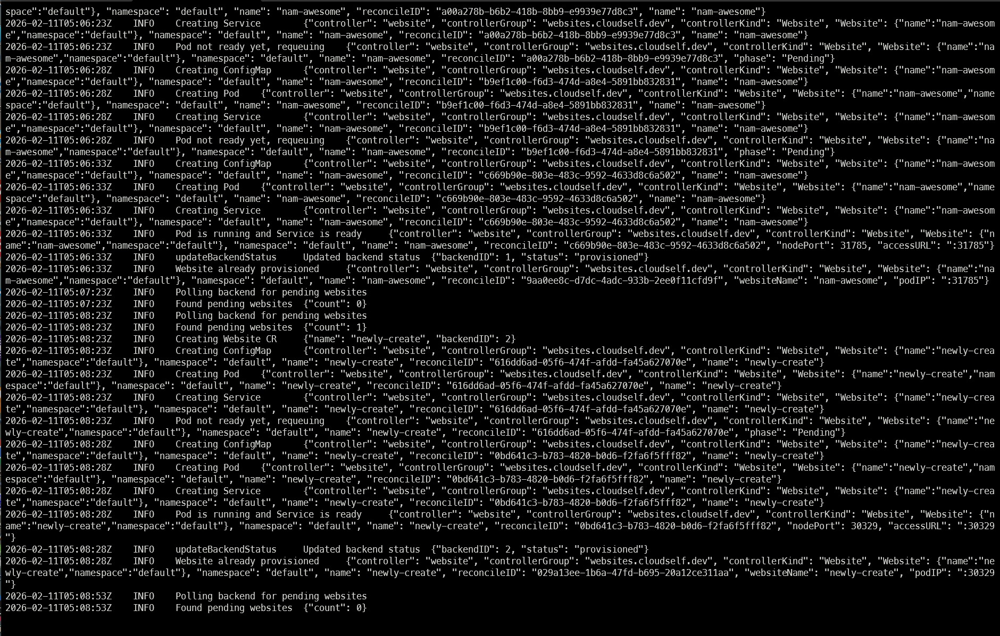

# How I Built “Wix on Kubernetes” Without Losing My Mind (78 Tasks, 3 Hours, Full Story)

If you’ve ever tried to build a platform where users submit website requests, Kubernetes spins up a pod with their HTML, and they can see the results live… you know the pain. Pods fail silently. Services refuse to expose. CRDs mock you with status `null` like they’re laughing at you.  



I did all this in **3 hours**, not 3 days. I had SDD guiding the tasks, AI generating boilerplate code, and a stubborn need to survive the chaos. Here’s how it went.  

---

## Phase 1: Setup — Laying the Foundations

Step one: create order from chaos. I had three independent components to tame:  

- **Frontend:** React + Vite + TypeScript  
- **Backend:** Node.js + Express + TypeScript  
- **Provisioner:** Go + Kubebuilder  

I started by creating the root folders. That’s always satisfying. It’s like laying down the foundation of a Lego city — cheap thrills for the first five minutes.  

```bash
mkdir frontend backend provisioner
```

Folders exist. Already, I feel accomplished.  

Next, I initialized the backend and frontend projects. Normally, you’d type commands, fix configs, fight with package managers… but AI helped me generate \`tsconfig.json\`, folder scaffolds, and base boilerplate in seconds. Tasks that would take 30–40 minutes each? Done in 3.  

```bash
cd backend && npm init -y
cd ../frontend && npm create vite@latest
```

Then Kubebuilder. I typed the init command, and AI made sure I didn’t miss \`--domain\` or \`--repo\`. Without that, Go would throw errors that feel designed to make you question your life choices.  

```bash
cd ../provisioner
kubebuilder init --domain cloudself.dev --repo github.com/yourorg/cloudself/provisioner
```

Docker Compose next — backend + MySQL — so I could spin up everything with one command. I watched containers start like tiny obedient minions.  

```yaml
version: '3.8'
services:
  backend:
    build: ./backend
    ports:
      - "3000:3000"
    env_file: .env
  mysql:
    image: mysql:8.0
    environment:
      MYSQL_ROOT_PASSWORD: root
      MYSQL_DATABASE: websites
    ports:
      - "3306:3306"
```

Then came the Minikube setup. Running a single script, I saw my Kubernetes cluster come to life. No drama… yet.  

```bash
#!/bin/bash
minikube start
kubectl config use-context minikube
```

Finally, a one-command setup script to combine Docker Compose + Minikube. Watching it run, I felt like I was summoning a small, polite storm of containers and pods.  

```bash
#!/bin/bash
docker-compose up -d
./minikube-setup.sh
```

By the end of Phase 1, I had a folder structure, local database, cluster, and AI-generated scaffolding. Not bad for 30 minutes.  

---

## Phase 2: Foundation — Core Infrastructure

Before I could submit a single website, I had to make sure the backend worked. This meant database, models, API, error handling, and Kubernetes CRDs.  

I started with the **MySQL migration** for websites:

```sql
CREATE TABLE websites (
    id INT AUTO_INCREMENT PRIMARY KEY,
    name VARCHAR(255) NOT NULL,
    html_content TEXT,
    status ENUM('pending','provisioned','failed') DEFAULT 'pending',
    pod_ip VARCHAR(15),
    created_at TIMESTAMP DEFAULT CURRENT_TIMESTAMP
);
```

Then the **database connection** in TypeScript. AI helped me generate typings and error handling. I didn’t cry once.  

```ts
import { Sequelize } from 'sequelize';

export const sequelize = new Sequelize(
  process.env.DB_NAME!,
  process.env.DB_USER!,
  process.env.DB_PASS!,
  {
    host: process.env.DB_HOST,
    dialect: 'mysql',
  }
);
```

Next came Express server + middleware. I added CORS, JSON parsing, and a basic error handler. Watching requests flow through was like watching water through a faucet — calming, until a pod dies silently in Kubernetes.  

```ts
import express from 'express';
import cors from 'cors';
import { errorHandler } from './middleware/errorHandler';

const app = express();
app.use(cors());
app.use(express.json());
app.use(errorHandler);

export default app;
```

Then I defined the **Website model**:

```ts
import { DataTypes, Model } from 'sequelize';
import { sequelize } from '../config/database';

export class Website extends Model {}

Website.init({
  name: { type: DataTypes.STRING, allowNull: false },
  htmlContent: DataTypes.TEXT,
  status: { type: DataTypes.ENUM('pending','provisioned','failed'), defaultValue: 'pending' },
  podIp: DataTypes.STRING,
}, { sequelize, modelName: 'website' });
```

Finally, **Kubebuilder API and CRD**. I watched AI generate Go structs, and then ran `make manifests` to produce YAML. Seeing my first `Website` CR appear in `kubectl get websites` was… oddly satisfying.  

```yaml
apiVersion: cloudself.dev/v1alpha1
kind: Website
metadata:
  name: example
spec:
  websiteName: example
  htmlContent: "<h1>Hello World</h1>"
```

Foundation complete. Database? ✅ API? ✅ Kubernetes CRD? ✅  

---

## Phase 3: User Story 1 — Submit a Website

Goal: Users can submit websites and see them listed as **pending**.  

Backend: `WebsiteService` and `WebsiteController`. Validation: DNS regex, HTML size ≤ 100KB, duplicate names.  

Frontend: React components `WebsiteForm` and `WebsiteList`, `HomePage` page, React Router, toast notifications.  

AI helped scaffold everything, and I ran backend + frontend in parallel. Watching submissions appear in the UI and database felt magical. One moment, the world is empty; next, a website request shows “pending” like a tiny digital toast popping up from the toaster.  

```tsx
<td>
  {website.status === "provisioned" ? (
    <a href={`http://${website.podIp}`} target="_blank" rel="noopener noreferrer">
      {website.podIp}
    </a>
  ) : (
    website.status
  )}
</td>
```

Checkpoint: MVP ready. Users can submit websites. They see “pending.” I breathe.  

---

## Phase 4: User Story 2 — Automatic Provisioning

Goal: Pending websites → provisioned in Kubernetes → status updated.  

Provisioner in Go polls the backend every 30 seconds. It creates CRDs, Pods, Services, updates the backend. AI scaffolds Pod/Service builders, and I debug Kubernetes issues — volumes don’t mount, services refuse NodePort, pods restart for fun.  

```go
func BuildPodSpec(site Website) *corev1.Pod {
    return &corev1.Pod{
        ObjectMeta: metav1.ObjectMeta{Name: site.Name},
        Spec: &corev1.PodSpec{
            Containers: []corev1.Container{
                {
                    Name:  "nginx",
                    Image: "nginx:latest",
                    VolumeMounts: []corev1.VolumeMount{
                        {Name: "html", MountPath: "/usr/share/nginx/html"},
                    },
                },
            },
            Volumes: []corev1.Volume{
                {Name: "html", VolumeSource: ConfigMapVolume(site.HTMLContent)},
            },
        },
    }
}
```

Watching the reconciliation loop work, and seeing `status: provisioned` appear in the backend… this is why we build software. Tiny victories.  



---

## Phase 5: User Story 3 — View Provisioned Websites

Users now see live pod IPs, clickable links, and detailed views. I added auto-refresh every 10 seconds, manual refresh button, and a modal for each website.  

```tsx
useEffect(() => {
  const interval = setInterval(fetchWebsites, 10000);
  return () => clearInterval(interval);
}, []);
```

Seeing a live website pop up after a 3-hour sprint made me want to take a victory lap around the room. Kubernetes may have tried to humiliate me, but I had **clickable IPs**.  

---

## Phase 6: Polish & Cross-Cutting Concerns

I added:  

- Quickstart guide  
- Component READMEs  
- OpenAPI + CRD documentation  
- Logging and health checks  
- Error messages in frontend  
- Performance test with 10 concurrent submissions  
- HTML sanitization and security checks  

Everything automated where possible. AI scaffolded tests, logs, and YAML. I mostly stayed alive.  

---

## Phase 7 and beyond: The Harsh Truth About Self-Service — Or How I Learned That Giving Users Power is a Terrible Idea

Three hours, 78 tasks, dozens of Pods, and a mild caffeine overdose later… I sat back and stared at my little self-service “Wix on Kubernetes” platform. And you know what hit me? Self-service is a lovely idea… until humans get involved. Or Kubernetes decides it hates you.  

### The Fantasy vs. The Ugly Reality

Self-service platforms promise: *“Empower users, automate everything, watch efficiency soar.”* Reality:  

- **Automation**: Sure, I scripted Pod creation and status updates, but nothing prepared me for the first Pod that refused to exist. Watching Minikube silently delete it like some digital Voldemort was humbling.  
- **User Experience**: My frontend is “good enough” — clickable IPs, status badges, toast notifications — but it’s basically a glorified spreadsheet with buttons. AWS CloudFormation dashboards? Forget it, they make this look like child’s play.  
- **Operational Stability**: Standardized, stable, enterprise-grade? Hah. My Pods crash like toddlers on sugar. If the big clouds handled their infrastructure like I did mine, we’d all be living in a perpetual “Kubernetes is down” panic.

### Brutal Lessons About Self-Service

1. **Users will break things**: Give them autonomy, and they will submit two websites with the same name, ignore validation rules, and probably ask for an SSL certificate for `localhost`.  
2. **Monitoring is never enough**: I built basic status checks and logs. Great. But nothing tells you a Pod died 3 seconds after you refreshed the page — and by the time the user screams, it’s already gone.  
3. **Flexibility is chaos**: Let users upload free-form HTML? Sure. Watch them break the Nginx container? Double sure. Standard templates would’ve saved me, but where’s the fun in that?  
4. **Polish costs time**: My clickable IPs feel like a victory, but no fancy dashboards, no metrics aggregation, no CloudWatch-style satisfaction. You either ship MVP or die polishing pixels.  

### Comparing My Chaos to the Giants

| Feature                     | Industry Giants | My Little Minikube Playground | Honest Notes                                   |
| --------------------------- | --------------- | ----------------------------- | ---------------------------------------------- |
| Automation & orchestration  | ✅               | ⚡ Semi-working                | Works if you whisper nicely to Pods            |
| Dashboard/UI                | ✅               | ⚡ Minimal                     | Clickable IPs, very low elegance               |
| Monitoring & logs           | ✅               | ⚡ Basic                       | Console spam + status badges, that’s it        |
| Infrastructure self-service | ✅               | ❌                             | Users cannot touch nodes, thank god            |
| Security & governance       | ✅               | ⚡ Minimal                     | Sanitized HTML, pray nothing malicious happens |
| Standard templates          | ✅               | ❌                             | One submission form to rule them all           |
| Reliability                 | ✅               | ⚡ Conditional                 | Pods survive if unicorns approve               |

Truth: I created a tiny, shaky, glorified demo of what Microsoft, Google, and Amazon do at scale. But it’s mine, it works (sometimes), and I didn’t cry… much.

### The Fun Part (Misery Loves Company)

Watching a Pod crash mid-refresh, the frontend flipping `status: failed`, and the user nervously clicking “retry” is like a tragicomic play. I felt simultaneously proud, frustrated, and mildly suicidal. But that’s self-service, baby. Chaos will find a way.  

### What I Took Away

- **Start tiny**: One form → one Pod → one dashboard. The rest is fantasy until you survive the first crash.  
- **Iterate ruthlessly**: AI scaffolding let me hack backend, frontend, and provisioning simultaneously. Without parallel tasks, I’d still be debugging YAML errors in 2026.  
- **Focus on essentials**: Submission, provisioning, status display. Everything else is gravy. You can polish later, if you survive Kubernetes hell.  

By the end, I realized: self-service is not about empowerment. It’s about controlled chaos. You give users power, they misuse it. You automate, Kubernetes ignores it. You build dashboards, users will still scream. And yet, somehow, it works. Most of the time. Enough to call it a victory.

Link to Repo: [https://github.com/nambuntu/k8s-selfservice](https://github.com/nambuntu/k8s-selfservice)